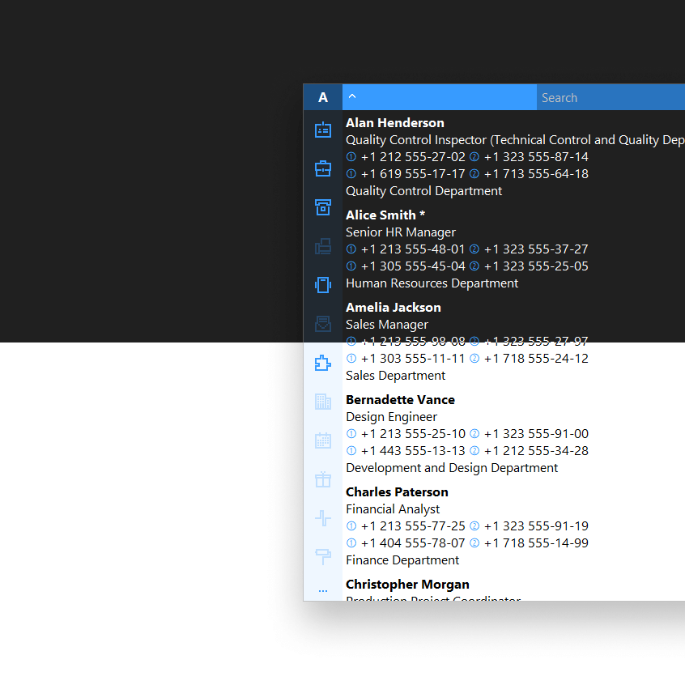

`file:` https://teamatica.org/Teamatica.exe

`date:` 2025-03-19

`size:` 1.80 MB

`scan:` https://virustotal.com/gui/file/4063678b979a5423445068312730cbfd549073af093db84486fa9e4fc20806c7

`demo:` https://teamatica.org/demo

`info:` https://teamatica.org/info.webp

`help:` https://teamatica.org/#6

`type:` self-hosted (on-premises)

`note:` https://teamatica.org/privacy-en.txt

`test:` https://github.com/teamatica/beta

`blog:` https://medium.com/@teamatica
